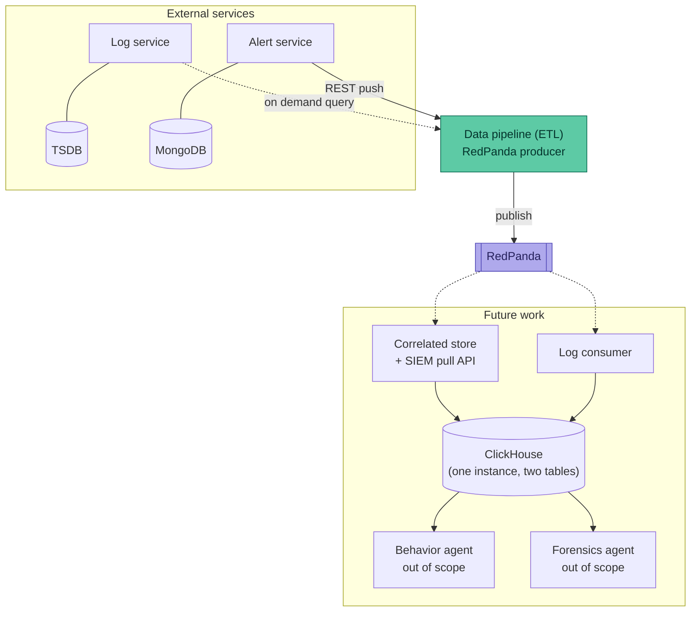
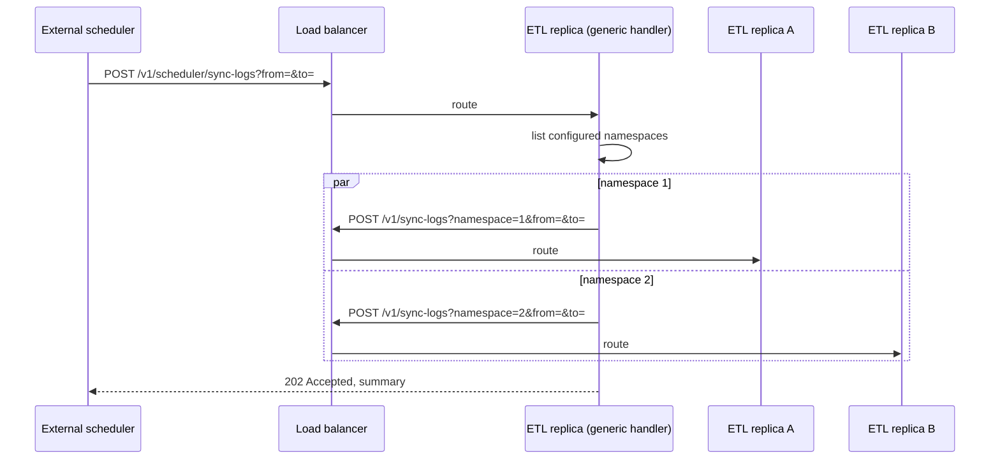
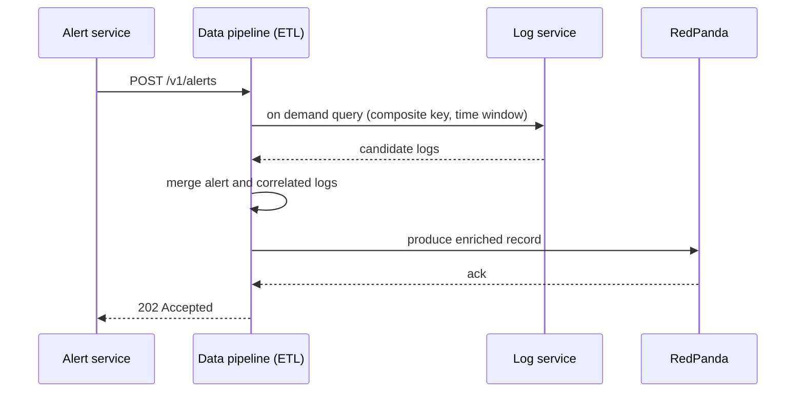
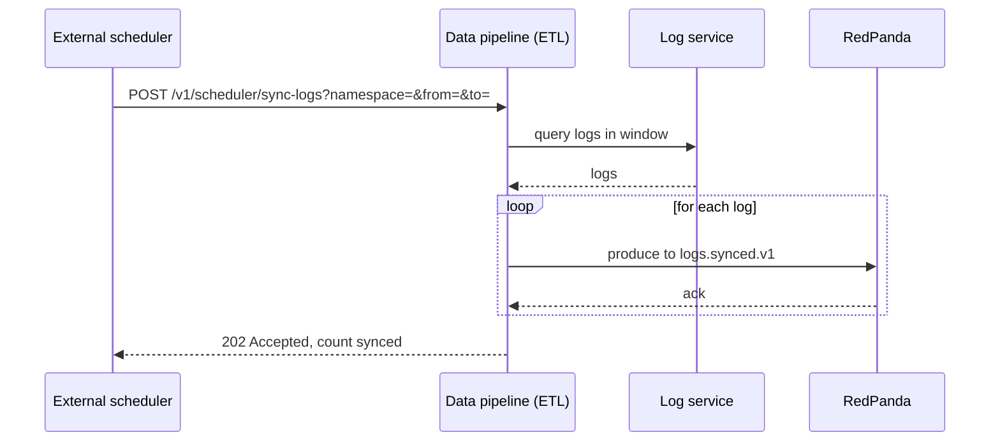

# AI Security Data Pipeline

## 1. Goal

The first version of a data pipeline for agentic communication logs and alerts.

## 2. Stakeholders

| Stakeholder | Need |
|---|---|
| Alert service owners | Every alert reliably reaches the pipeline. v1: push via REST `POST`. A reconciliation job backstops delivery gaps. |
| Log service owners | Expose a per-tenant log query API (start/end timestamp range) the pipeline can pull from. |
| SIEM / security analysts | Timely, reliable delivery of raised alerts, with enough context to investigate; flexible integration (push or pull) |
| Forensics investigator / agent (out of scope) | On-demand, org-wide access to alerts *and* the logs that produced them |
| Behavior-analysis agent (out of scope) | Per-user activity across multiple AI providers, aggregated over a multi-day window (e.g. 1 week) |
| Org / tenant admins | Ability to configure which SIEM connector type(s) their org uses, without pipeline changes |

**Alert ingestion:** v1 uses REST `POST` from the alert service into the pipeline. A message queue is a natural future step, decoupling the pipeline's internal bus choice from the alert service's own integration. A periodic background reconciliation task (compare what the alert service holds against what the pipeline has ingested) provides failure recovery independent of the alert service's own availability, decoupling the pipeline's availability guarantee from the alert service's.

**Log ingestion:** rather than the log service pushing individual events, it exposes a per-tenant query API over a `start`/`end` time range, and the pipeline pulls from it. This shape isn't arbitrary: it's exactly what alert↔log correlation needs (tenant + time window), and correlation is what gives ingested logs their value in this pipeline. Logs ingested without that correlation are not, by themselves, useful here.

## 3. Design Considerations

### Assumption

We cannot assume the alert-raising process (out of scope) guarantees a foolproof, exact link back to the specific log(s) that triggered it. Alerts may come from static rules or from inference, and neither is guaranteed to leave an exact log-level trace.

### Design Decisions

1. **SIEM export** supports push as well as pull model, configurable per org. In the first version, RedPanda based push and REST API based pull are implemented; other modes like webhook, email, etc. are left as future work.
2. **Correlation approach:** best-effort composite-key and time-window match, evaluated on demand at alert arrival rather than via a standing synced copy of logs. The alert itself already scopes what to look for and when.
3. **Alert and correlated-log storage:** the alert and its correlated logs are persisted together, once, in a single combined store, populated by a stream consumer reacting to pushed alerts. Underlying engine (e.g. something ClickHouse-like) is deliberately left unspecified and out of scope. Since correlation is a one-time, on-demand action, there is no reason to keep two stores that need re-joining on every read.
4. **Forensics access:** reads directly from that combined store, scoped by namespace and time range.
5. **Transport:** alerts pushed via REST plus periodic reconciliation as a failure backstop; logs pulled via a per-tenant range query API, per the stakeholder requirements in Section 2. Reconciliation itself is left as future work for this exercise; when built, it would be exposed as an API on the Data pipeline service rather than a separate component.
6. **Behavior analysis:** precomputed rollups fed by a scheduled, not alert-triggered, per-tenant log pull, since it needs a user's full activity independent of whether any alert ever fired.

## 4. High-Level Architecture



**Narrative:** this exercise builds only the Data pipeline (ETL) service, shown solid above. It receives alerts pushed from the Alert service, queries the Log service on demand to correlate a given alert's composite key and time window, and produces the merged result onto RedPanda. Nothing downstream of RedPanda is built here.

Everything inside the future work boundary is design only. A Correlated store service would consume the stream and persist it into ClickHouse, and would also expose the SIEM pull API from there, since a persisted store answers faster than re-running the correlation join live on every SIEM request. A separate Log consumer service would persist a broader log-oriented view into the same ClickHouse instance, on its own table rather than a separate instance, to keep operational overhead to one database for whoever administers it. The Behavior agent and Forensics agent, both out of scope per the original brief, would read from that shared store rather than subscribing to RedPanda directly, since a queryable store is a more natural integration point for an agent than a message topic.

## 5. Data Model & Correlation

The Log and Alert documents are used as given in the challenge spec (see appendix for full example payloads). Key fields used for correlation:

| Field | On Log | On Alert (`alertEvents[]` entry) |
|---|---|---|
| Alert definition name | `alerts[].alertDefinition` | `alertDefinition` |
| Namespace | `alerts[].alertDefinitionNamespace` | `alertDefinitionNamespace` |
| Provider | `provider` | `provider` |
| User | `principal.user.name` | `principal.user.name` |
| Time | `time` | `timestamp` (falls within parent Alert's `start`/`end`) |

**Join strategy:** for a given Alert, take each `alertEvents[]` entry's `(alertDefinition, alertDefinitionNamespace, provider, principal.user.name)` as a lookup key. The Data pipeline service queries the Log service on demand for Logs matching that key within `[alert.start − ε, alert.end + ε]`. This returns the *candidate* set of Logs that produced the alert.

**Known limitation:** this is best-effort. If the same user triggers the same `alertDefinition` from the same provider more than once inside a single cooldown window (rare, since the cooldown exists specifically to suppress that), the join cannot distinguish which specific Log(s) caused which `alertEvents[]` entry. This is documented in §12 along with the v2 fix.

## 6. Data Pipeline (ETL) Service

The only component built in this exercise. Stateless and horizontally scalable: any number of replicas run behind a load balancer with no coordination between them, since each request is handled independently and nothing is held in memory across requests.

### Namespace configuration
- The service needs to know which namespaces it's enabled for, both to gate alert admission (reject or ignore alerts for namespaces not enabled) and so the external scheduler knows which namespaces to call `sync-logs` for.
- v1: a static configured list, deployed as part of the service's own configuration. The external scheduler reads the same list from the same source, so both sides agree on which namespaces are active without calling each other to find out.
- Future work: an API backed by a database, so namespaces can be enabled or disabled dynamically without redeploying either the service or the scheduler's configuration.

### Alert admission
- `POST /v1/alerts`, called by the Alert service.
- Handling is synchronous end to end: validate the payload, confirm the alert's namespace is configured (above), query the Log service on demand for logs matching the alert's composite key and time window, merge the alert with whatever logs match, and produce the merged record onto RedPanda.
- The response returns once the RedPanda produce is acknowledged, so a successful response means the record is durably on the bus, not just accepted for later processing.
- No internal buffering or worker platform is needed here. Throughput scales by adding replicas, not by adding internal concurrency machinery to a single instance.

### Log sync
Two endpoints, not one:

- **`POST /v1/scheduler/sync-logs?from=&to=`** is the generic one the external scheduler calls, on a schedule, with no namespace. Its handler looks up the configured namespace list (above), then calls the single-namespace endpoint below once per namespace, in parallel. Each of those calls goes back through the load balancer, so the fan-out is spread across replicas rather than one instance working through every namespace on its own. This keeps the external scheduler simple: it doesn't need to know which namespaces exist, only that this one endpoint exists.
- **`POST /v1/sync-logs?namespace=&from=&to=`** does the actual per-tenant work: query the Log service for that one tenant's logs in the given window, and produce each one onto `logs.synced.v1`.
- Both take `from`/`to` from the caller rather than tracking a watermark internally, so the service stays stateless, which window to sync is the scheduler's decision, passed through unchanged at each level.
- The generic handler waits for all of its parallel calls to complete before responding, so its response summarizes results across every namespace in one place.
- Built in this version, ahead of any consumer for `logs.synced.v1`. Correlated store and Log consumer (Section 10) still don't exist yet, so nothing drains this topic today, the 7-day retention (Section 7) is what makes that acceptable in the meantime.



### Reconciliation (future work)
- `POST /v1/scheduler/reconcile`, exposed on this same service, triggered by an external scheduler rather than run internally, so the service stays stateless: any replica can serve the call, with no leader election or shared state needed to avoid two replicas running the same pass at once.
- Would compare the Alert service's records against what's already been produced to RedPanda (via the dedup cache, Section 10) and re-produce anything missing. Not built in this version.






## 7. RedPanda Design

- **Topics:** `alerts.enriched.v1`, produced by alert admission. `logs.synced.v1`, produced by the `sync-logs` scheduled task (Section 6). Both are built in this version; the ETL service is the only producer on either.
- **Partitioning:** by `namespace` on both topics, so each org's records stay ordered within themselves, giving any future per-tenant consumer a natural scaling boundary.
- **Message schema:** `alerts.enriched.v1` carries the merged alert plus correlated logs record; `logs.synced.v1` carries individual log records (full shapes in the appendix).
- **Delivery semantics:** the producer requires full acknowledgment before the ETL service returns its own response (Section 6), so a `202` means the record is durably on the bus.
- **Retention:** 7 days initially, on both topics. No consumer exists yet for either, since Correlated store and Log consumer (Section 10) are both future work, so nothing is continuously draining them. A 7-day window gives room for those consumers to come online and catch up without data loss. Once they're running and keeping pace, retention should be reconfigured down to whatever a durable buffer for replay actually needs, rather than staying at this initial, deliberately generous setting.

## 8. Scalability & Reliability

- **Horizontal scaling:** the ETL service is stateless, so scaling is purely a matter of replica count behind a load balancer. No component-specific scaling logic is needed.
- **RedPanda as the buffer beyond the service:** once a record is produced and acknowledged, durability and further processing are RedPanda's problem, not the ETL service's. The 7-day retention (Section 7) is the current safety margin.
- **Duplicate delivery gap (v1):** if the Alert service retries `POST /v1/alerts`, for example after a timeout where it never saw the response, the ETL service has no way today to recognize that and will produce the same alert to RedPanda a second time. This is an accepted gap in v1, not something handled yet.
- **Future fix, tied to reconciliation:** a persistent, distributed cache, for example Redis, holding the IDs of alerts already produced to RedPanda. Before producing, the ETL service would check the cache: a hit means skip, a miss means produce and record the ID. The same cache serves the reconciliation job (Section 10), which needs to know what has already been produced so it doesn't re-push duplicates while catching up on gaps. Cache retention should be sized against the reconciliation job's own cadence rather than fixed arbitrarily, for example a day of retention if reconciliation runs hourly, so a delayed or backed up reconciliation pass still has entries to check against. Neither the cache nor reconciliation itself is built in this version.
- **Sync-logs has the same duplicate risk, without the same fix available:** if a retried call to `POST /v1/sync-logs` covers a window already synced, whether the retry comes from the scheduler retrying the generic endpoint or a retry at the fan-out level, the same logs get produced to `logs.synced.v1` a second time. Unlike alerts, logs have no natural unique ID (see Section 5), so the alert dedup cache's approach doesn't carry over directly. This is an open gap in v1, not just deferred like reconciliation, since there isn't yet a clear key to dedup logs against.

## 9. Security & Multi-Tenancy

- Every API this service exposes, `POST /v1/alerts`, `POST /v1/sync-logs`, `POST /v1/scheduler/sync-logs`, and the future `POST /v1/scheduler/reconcile`, is called service-to-service only. No end-user login context ever reaches this service.
- Authentication and authorization happen at the API gateway in front of the service, not inside the service itself. The gateway terminates mTLS and decides which caller may hit which endpoint for which namespace, before the request ever reaches this service.
- Since there's no user identity involved anywhere in this flow, the credential is an mTLS client certificate, not an API key. An API key implies a user or account context that doesn't exist here.
- `POST /v1/alerts` and `POST /v1/sync-logs` are namespace-scoped: each caller's certificate maps to the one namespace it's authorized to act on. `POST /v1/scheduler/sync-logs` and the future `POST /v1/scheduler/reconcile` are not namespace-scoped, since they trigger work across every configured namespace at once, and are only reachable by the external scheduler's own certificate, not by any namespace-scoped caller.
- Separately from gateway-level auth, the service itself still rejects a request for a namespace not in the configured list (Section 6), a valid, authenticated caller for a namespace that simply isn't enabled for the pipeline is still turned away.
- RedPanda's `alerts.enriched.v1` and `logs.synced.v1` topics are both partitioned by `namespace` (Section 7), which doubles as a tenant-isolation and per-tenant scaling boundary for whatever consumes them later.
- TLS is assumed for the service's connection to RedPanda as well, separate from the mTLS the gateway enforces on inbound REST calls.

## 10. Future Work

None of this is built in this exercise. It's documented here so the ETL service's design (RedPanda topics, message schemas, namespace partitioning) is known to support it without rework later.

- **Namespace configuration API:** replacing the static configured list (Section 6) with an API backed by a database, so namespaces can be enabled or disabled dynamically, for both the service's own admission gating and the scheduler's fan-out, without redeploying either.
- **Correlated store service:** a RedPanda consumer that persists every enriched record from `alerts.enriched.v1` into ClickHouse. Also exposes the SIEM pull API from there, since answering from a persisted store is faster than re-running the correlation join live on every SIEM request.
- **Log consumer service:** a RedPanda consumer on `logs.synced.v1`, already being produced to in this version by `sync-logs`, persisting into the same ClickHouse instance as Correlated store, on its own table rather than a separate instance, to keep operational overhead to one database for whoever administers it.
- **Behavior agent and Forensics agent:** both out of scope per the original brief. They would read from ClickHouse, downstream of Log consumer, rather than subscribing to RedPanda directly, since a queryable store is a more natural integration point for an agent than a message topic.
- **Reconciliation:** `POST /v1/scheduler/reconcile` on the ETL service, triggered by an external scheduler rather than run on an internal timer, so the service stays stateless and scaling replicas doesn't risk duplicate runs.
- **Duplicate-produce dedup cache:** a persistent, distributed cache (for example Redis) holding the IDs of alerts already produced to RedPanda, checked before producing so a retried `POST /v1/alerts` doesn't create a duplicate record. The same cache backs `reconcile`, letting it skip alerts already produced while catching up on gaps. Retention should exceed the reconciliation cadence by a comfortable margin, for example a day of retention against an hourly reconciliation schedule.

## 11. Trade-offs & Known Limitations

| Limitation | Impact | Future direction |
|---|---|---|
| Best-effort Alert-Log correlation | Rare misattribution risk when the same composite key repeats within one cooldown window | Producers echo an explicit `correlationID`, enabling exact joins as a first-class case with composite-key fallback |
| No dedup on alert admission in v1 | A retried `POST /v1/alerts` can produce a duplicate record onto RedPanda | Persistent Redis cache of already-produced alert IDs, checked before producing (Section 10) |
| No dedup on sync-logs in v1 | A retried `POST /v1/scheduler/sync-logs` for the same window can produce duplicate log records onto `logs.synced.v1` | Unclear yet, logs have no natural unique ID to dedup against, unlike alerts; needs its own solution, not just the alert dedup cache |
| No reconciliation in v1 | A dropped or lost alert push has no automatic recovery path | `POST /v1/scheduler/reconcile` driven by an external scheduler (Section 10) |
| Nothing consumes RedPanda yet | 7-day retention (Section 7) is a stopgap, not a durability guarantee | Correlated store and Log consumer landing removes the need for a long retention window |

## 12. Proving Quality & Efficiency

Once an implementation exists, this design should be validated against:

- **Admission latency** under increasing request load, should scale flat with replica count rather than degrading.
- **Log service query latency**, isolated from the rest of the request, since it's an external dependency outside this service's control.
- **RedPanda produce latency**, from call to acknowledgment.
- **End-to-end alert-to-bus latency**, the full `POST /v1/alerts` request lifecycle.
- Once the future work in Section 10 lands: dedup cache hit/miss overhead, and reconciliation catch-up time after a deliberately introduced gap.

## 13. Appendix: API Contracts

### `POST /v1/alerts`
```json
{
  "ID": "68dbdf7181fbcb00012b3ec2",
  "alertDefinitionName": "secrets",
  "alertEvents": [
    {
      "alertDefinition": "secrets",
      "alertDefinitionNamespace": "/orgs/acuvity.ai/employees",
      "principal": { "user": { "name": "john@proofpoint.com" } },
      "provider": "chatgpt",
      "timestamp": "2025-09-30T13:49:15.942933405Z"
    }
  ],
  "counter": 2,
  "namespace": "/orgs/acuvity.ai/employees",
  "start": "2025-09-30T13:47:29.444Z",
  "end": "2025-09-30T13:49:15.942Z"
}
```
Response: `202 Accepted` once the merged record has been produced and acknowledged on RedPanda.

### `POST /v1/scheduler/sync-logs`
```
POST /v1/scheduler/sync-logs?from=2025-09-30T13:00:00Z&to=2025-09-30T14:00:00Z
```
Called by an external scheduler, which supplies the sync window but no namespace. Internally lists the configured namespaces (Section 6) and calls `POST /v1/sync-logs` once per namespace, in parallel. Response summarizes how many logs were synced, across all namespaces.

### `POST /v1/sync-logs`
```
POST /v1/sync-logs?namespace=/orgs/acuvity.ai/employees&from=2025-09-30T13:00:00Z&to=2025-09-30T14:00:00Z
```
Called by the generic scheduler handler above, once per configured namespace, through the load balancer. Pulls that tenant's logs in the given window from the Log service and produces them onto `logs.synced.v1`. Response summarizes how many logs were synced for this one namespace.

### `POST /v1/scheduler/reconcile` (future work)
```
POST /v1/scheduler/reconcile?namespace=/orgs/acuvity.ai/employees
```
Triggered by an external scheduler, not built in this exercise. Response summarizes how many alerts were found missing and re-produced.

### Log service query (external dependency)
The shape this service assumes the Log service's per-tenant range query API exposes, called both on demand during correlation and by `sync-logs`:
```
GET /logs?namespace=/orgs/acuvity.ai/employees&provider=chatgpt&user=john@proofpoint.com&alertDefinition=secrets&from=2025-09-30T13:47:00Z&to=2025-09-30T13:50:00Z
```
Response is a wrapped object, not a bare array, so the shape can gain new top-level fields later without breaking existing callers:
```json
{
  "logs": [
    { "...": "Log document as given in the challenge spec" }
  ]
}
```
Note that per user for this API could be added later if the alerts are confirmed to be per user.

### RedPanda message schema, topic `alerts.enriched.v1`
```json
{
  "alert": { "...": "Alert document as above" },
  "correlatedLogs": [
    { "time": "...", "extractions": ["..."] }
  ]
}
```

### RedPanda message schema, topic `logs.synced.v1`
```json
{
  "namespace": "/orgs/acuvity.ai/employees",
  "provider": "chatgpt",
  "principal": { "user": { "name": "john@proofpoint.com" } },
  "time": "2025-09-30T13:47:29.471Z",
  "extractions": ["..."]
}
```
